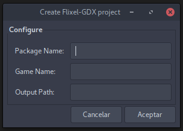

# Flixel-gdx Fork (name pending)

Fork of [flixel-gdx](http://flixel-gdx.com 'flixel-gdx homepage') with tweaks for it's use at Rombosaur Studios.

## Changes

- Libgdx updated to 1.9.4. Flixel-gdx updated accordingly (not thoroughly tested, and with some todo's)

- IntelliJ IDE integration

- Project generation script

- Personal tweaks

- Fixed wiki markdown

## Project generation script

_The cheapest gdx-setup-ui ever!_



It's a bash script so **Linux only**. It also depends on _zenity_.   
Run it with the following command:

```bash
    ./gdx-setup-ui.sh
```

fill in all the form inputs, and hit the _Ok_ button.

----

If you don't want to install _zenity_ you can run the following command:

```bash
    ./gen-project.sh [package_name] [game_name] [output_folder]
```

The output will be ugly, as it's supposed to be piped to zenity, but it'll work.

----

For the rest, treat the project as a gradle based Libgdx project (open the build.gradle from intellij as project and etc...).
